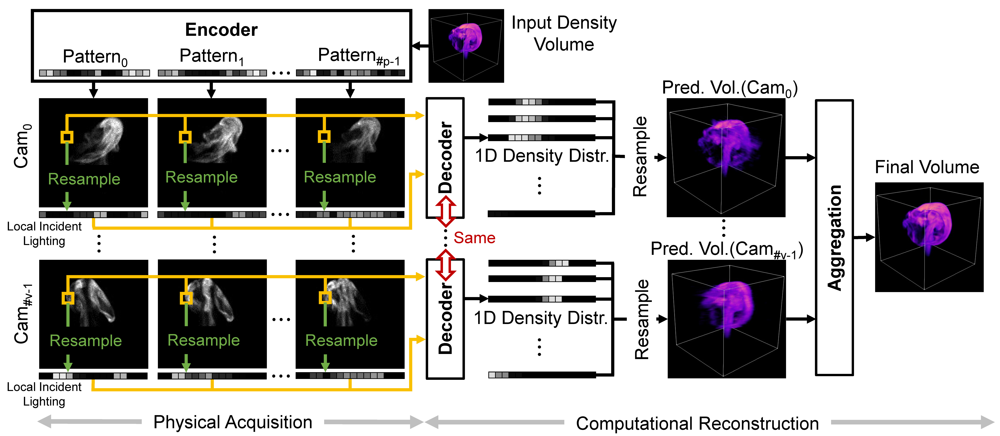
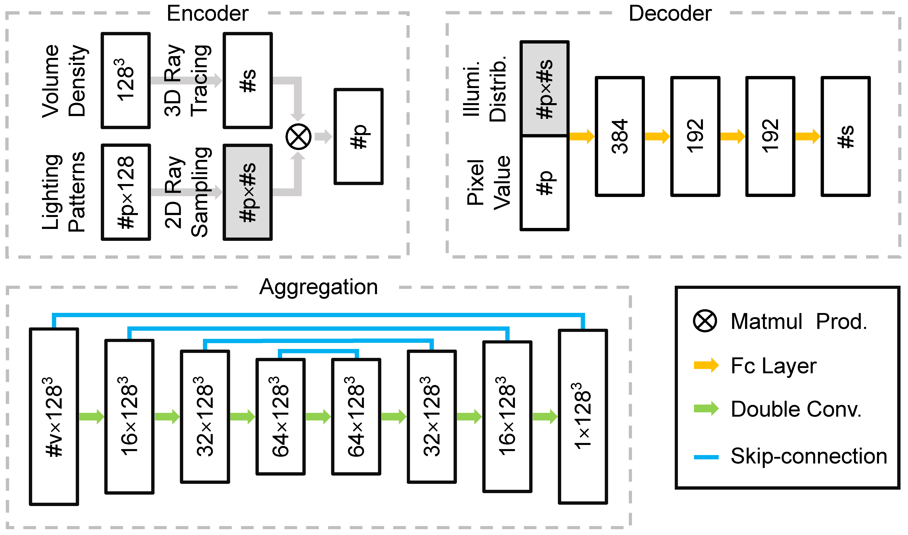

# Real-time Dynamic

This is the code for CVPR2024 paper:

**Real-time Acquisition and Reconstruction of Dynamic Volumes with Neural Structured Illumination**

by Yixin Zeng, Zoubin Bi, Mingrui Yin, Xiang Feng, Kun Zhou and Hongzhi Wu*.

[Project Page](https://svbrdf.github.io/publications/realtimedynamic/project.html)

## Introduction

We propose a novel framework for real-time acquisition and reconstruction of temporally-varying 3D phenomena with high quality. Using as few as 6 pre-optimized structured light patterns, we capture and reconstruct dynamic 3D volumes from corresponding image measurements at different views, with a lightweight projector-camera setup.

<div align="center">

</div>

Our network consists of 3 parts:

- The encoder simulates the measurement process, linking the light patterns, the input density volume and the output image measurements in a differentiable manner. 
- The decoder consists of 4 fc layers and works on a per-pixel basis. It takes as input the measurements at the same pixel location and the corresponding local incident lighting, and outputs a 1D density distribution along the corresponding camera ray. 
- The aggregation module take as input the 3D volumes predicted by the decoder for each camera, and fuse the multi-view information to output a high-quality volume with a 3D UNet.

<div align="center">

</div>

## Data Generation

We generate our data with mantaflow, based on the data generate code from [tempoGAN](https://github.com/thunil/tempoGAN).

### Installation

- h5py
- python-numpy
- [Mantaflow](http://mantaflow.com/install.html)

Note: for ubuntu version after 20.04, it is likely package ‘qt5-default’ can not be installed. Instead you can use:

```
sudo apt-get install build-essential
sudo apt-get install qtbase5-dev qtchooser qt5-qmake qtbase5-dev-tools
sudo apt-get install qtcreator
```

And numpy should be allowed in mantaflow installation, so the cmake sentence should be changed into:

```
cmake .. -DNUMPY=ON -DOPENMP=ON
```

Then use the following command to generate data:

```
mkdir data
./mantaflow/mantaflow-master/build/manta ./gen_data/gen_data.py
```

It takes about 3.5 hours to generate all the data.

## Training

### Environment

- pytorch-cuda
- numpy
- wandb
- tqdm
- h5py
- opencv-python
- annoy

### Train

Download our precompute raytrace information and put it into folder './ray_trace_info': https://drive.google.com/drive/folders/1wcARMfjGN1RHn8q43yPRLg6-AUR_JRPi?usp=drive_link.

After wandb login, run the following command with multiple gpus:

```
CUDA_VISIBLE_DEVICES=0,1,2,3 python -m torch.distributed.launch --nproc_per_node=4 train128_cal3.py
```

The training takes about 1-2 days.

### Test

Run the following command:

```
mkdir our_result
python predict.py
```

The simulated measurements and predicted volume results are in `./our_result/`.

## Apply to Your Device

For specific real-world device, the ray trace information used for resample process in training and testing need to be precomputed before training.

Take camera-projector device for example, with calibrated camera and projector(also see calibration algorithm in supplementary material of our paper), run the following code:

```
./gen_ray_trace_info/raysample_kdtree_subprocess.py
./gen_ray_trace_info/raysample_rescale_subprocess.py
./gen_ray_trace_info/cal_ray_trace_info.py
```

The camera and projector calibration parameters of ours are provided in `./ray_trace_info/intrinsic_proj_cam_42000.yml`. 

The volume location with respect to the projector in line 106 of `./gen_ray_trace_info/raysample_kdtree.py` is roughly estimated from real scene. The `hmin` and `hmax` parameter in `./gen_ray_trace_info/raysample_rescale.py` and  `./gen_ray_trace_info/raysample_rescale_subprocess.py` is roughly estimated from the 2D location of volume projection in real camera photos. The `cpunum` parameter in `./gen_ray_trace_info/raysample_rescale_subprocess.py` and `./gen_ray_trace_info/raysample_kdtree_subprocess.py` is decided by the number of cpus in your machine.

It takes about 2 hours to finish the precomputation.
